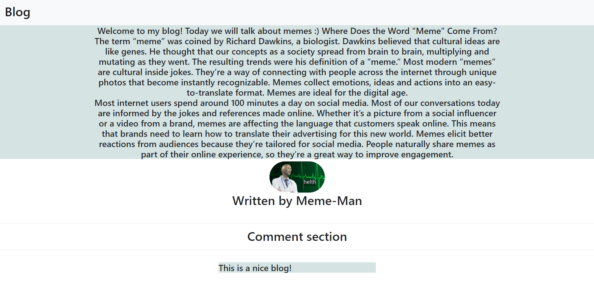
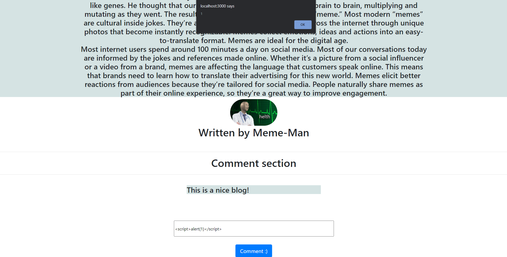

# Comment-killer

<p align="center">
    
</p>

Comment-killer is a simple ReactJS app, which has a Injection (XSS) vulnerability and its main goal is to describe how a malicious user could exploit it on this purposefully vulnerable app.

# Index

- [Definition](#what-is-cross-site-scripting)
- [Setup](#setup)
- [Attack narrative](#attack-narrative)
- [Objectives](#secure-this-app)
- [Solutions](#pr-solutions)
- [Contributing](#contributing)

<a name="Def"></a>

## What is Cross-Site Scripting?

XSS flaws occur whenever an application includes untrusted data in a new web page without proper validation or escaping, or updates an existing web page with user-supplied data using a browser API that can create HTML or JavaScript. XSS allows attackers to execute scripts in the victim’s browser which can hijack user sessions, deface web sites, or redirect the user to malicious sites.

The main goal of this app is to discuss how **Cross-Site Scripting** vulnerabilities can be exploited and to encourage developers to send secDevLabs Pull Requests on how they would mitigate these flaws. Learn more <a href="https://owasp.org/www-community/attacks/xss/">here</a>.

<a name="Set" ></a>

## Setup

Despliegue :: Descargar y Ejecutar el Proyecto

1. Clonar el proyecto

git clone https://github.com/liliantbo/UPS-A03-Taller3.git

2. Ir a la carpeta del proyecto

cd comment-killer/app

3. Instalar dependencias

npm install

4. Iniciar el servidor de desarrollo local

npm start

En caso de obtener 

opensslErrorStack: [ 'error:03000086:digital envelope routines::initialization error' ],
  library: 'digital envelope routines',
  reason: 'unsupported',
  code: 'ERR_OSSL_EVP_UNSUPPORTED'

ejecutar
set NODE_OPTIONS=--openssl-legacy-provider

Then simply visit [http://localhost:10007](http://localhost:10007) ! 😆

## Get to know the app 👾

To properly understand how this application works, you can follow these simple steps:

- Read the cool history behind the Memes.
- Add a new comment post.

## Attack narrative

Now that you know the purpose of this app, what could go wrong? The following section describes how an attacker could identify and eventually find sensitive information about the app or its users. We encourage you to follow these steps and try to reproduce them on your own to better understand the attack vector! 😜

### Note: This attack narrative works best in Mozilla Firefox.

### 👀

### Non-sanitization of user input allows for cross-site scripting

After inspecting the application, it is possible to identify that the comment entry is not sanitized and can be executed on a web browser. The following images show this behavior when the following text is used as an input on these fields:

```
<script>alert(1)</script>
```

Adding a new comment to a post:

<p align="center">
    
</p>

The missing input validation allows a malicious user to insert some scripts that will persist in the server and be executed on the victims' browser every time they access the routes that contain these scripts.
